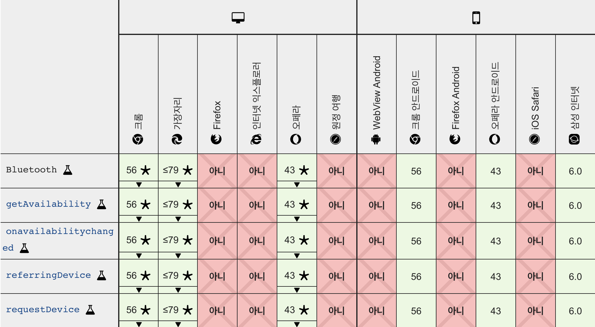
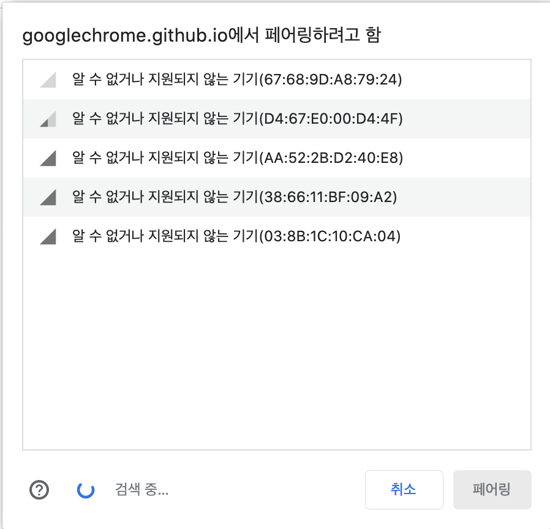

## Web Bluetooth API?
브라우저에서 Bluetooth 통신으로 주변장치와 상호작용을 할 수 있습니다. 이는 실험적 기술이며 일부 브라우저에서 지원하고 HTTPS 환경에서만 작동됩니다. (Chrome, Edge) 만약 블루투스 통신이 필요한데 안드로이드나 IOS의 지식이 부족하다면 Web을 통하여 통신하는것은 어떨까요?


## Bluetooth 모듈
웹과 통신할 블루투스 모듈이 필요합니다. 저는 이미 블루투스 모듈 HM-06을 가지고 있었지만 HM-10 구매해서 사용했습니다. 왜냐하면 웹과 블루투스 통신을 하려면 bluetooth 4.0 버전 이상이 필요합니다. 그러나 HM-06 모듈은 bluetooth 4.0을 지원하지 않기 때문입니다.

[HM-10 스펙](https://componxents101.com/wireless/hm-10-bluetooth-module)

## Arduino
배선은 간단합니다. VCC, GND는 기본적으로 연결하고, RX, TX핀에 교차하여 연결하거나 SoftwareSerial.h 헤더파일을 사용해 통신에 사용될 핀을 설정합니다. 자세한 설명은 밑에 링크에서 확인할 수 있습니다.

[HM-10 배선 및 소스코드](https://m.blog.naver.com/eduino/220903237343)

그 후 시리얼을 킨 후 AT 명령어를 활용하여 블루투스 모듈을 설정 및 값을 가져옵니다.
1. AT+ROLE0
2. AT+NAME[사용할 이름]
3. AT+RESET
4. AT+UUID
5. AT+CHAR

4번과 5번에서 나온 결과를 꼭 기억 해두세요.

## Web
이제 웹에서 데이터를 보내거나 받을 차례 입니다.
```html
<button id="bluetoothButton">블루투스!</button>

<script>
const bluetoothButton = document.getElementById("bluetoothButton")

bluetoothButton.addEventListener("click", () => {
  navigator.bluetooth.requestDevice({
    filters: [{ services: ["4번 결과 값"] }]
  })
})
</script>
```
웹페이지 접속과 동시에 bluetooth 연결요청을 할 수 없습니다. 버튼 한개를 만들어 클릭시 장치를 찾게 만들어 줍니다. filters에 services에 아무 값도 입력하지 않으면 연결 할 수 있는 모든 장치가 나타나므로 우리가 원하는 모듈을 쉽게 찾기 위해 4번에서 나온 UUID를 services 안에 넣어 줍니다.



버튼을 클릭할 경우 주소창 쪽에 위와 같이 페어링할 장치를 찾는 팝업이 뜨게 됩니다.

## 본격적으로 통신하기
이제 페어링할 장치를 찾았습니다. 본격적으로 통신에 들어가 봅시다.
```javascript
windowNavigator.bluetooth.requestDevice({
  filters: [{ services: ["4번 결과 값"] }]
})
.then(function(device) {
  getDevice(device)
  return device.gatt.connect();
})
.then(function(server) {
  return server.getPrimaryService("4번 결과 값");
})
.then(function(service) {
  return service.getCharacteristic("5번 결과 값");
})
.then(function(characteristic) {
  getCharacteristic(characteristic);
})
.catch(function(error) {
  console.error('Connection failed!', error);
});
```
GATT서버에 연결을 하고 service와 characteristic값을 얻습니다. 이로써 웹에서 통신할 기본 설정은 끝이고 이제 데이터를 읽고 쓸 차례입니다.

### 페어링 해제
```javascript
function getDevice(device) {
  device.addEventListener('gattserverdisconnected', () => {
    alert("디바이스 연결이 끊어졌습니다.");
  });
}
```
디바이스 정보를 얻게 되면 'gattserverdisconnected' 이벤트로 페어링 해제를 감지 할 수 있습니다.

### 데이터 전송
```javascript
function getCharacteristic(characteristic) {
  characteristic.writeValue(new Uint8Array([0x04, 0x03, 0x02, 0x01]))
}
```
Unit8Array에 데이터를 담아 통신이 가능합니다. 20byte 제한이 걸려 있습니다. 위 코드는 순서대로 4, 3, 2, 1 데이터를 라인마다 송신합니다. 송신한 값은 아두이노에서 Serial.read 함수를 사용해 하나씩 받아 올 수 있습니다.

### 데이터 받기
```javascript
function getCharacteristic(characteristic) {
  characteristic.startNotifications().then(() => {
    characteristic.addEventListener('characteristicvaluechanged', function(e) {
      const value = e.target.value.getUint8(0).toString(10);
      console.log(value);
    });
  })
}
```
데이터 또한 Uint8 형식으로 넘어와 다음과 같이 값을 읽을 수 있습니다.


## 블루투스 통신 결과물


제가 웹과의 블루투스 통신을 통하여 제작한 로봇입니다. 웹을 사용하여 로봇을 조종하는 모습을 확인 할 수 있습니다. 

[git 소스코드](https://github.com/dawan0111/coding-robot)


## 참고
[web bluetooth api examples](https://googlechrome.github.io/samples/web-bluetooth/)