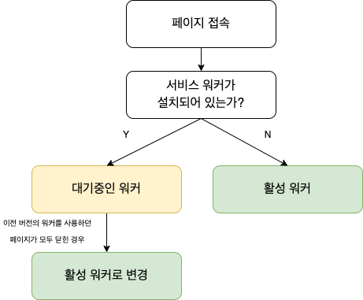
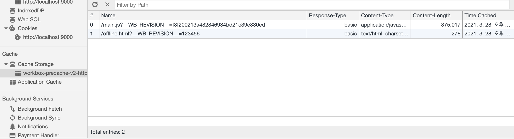

Workbox는 Service worker 설정에 도움을 주는 라이브러리 입니다. 이 글 에서는 다음과 같은 내용을 포함하고 있습니다.
 - service worker에 대한 간략한 설명
 - Workbox 시작하기
 - 인터넷 연결이 없을때 오프라인 페이지 띄우기

# Service Worker란:question:
서비스 워커는 브라우저가 백그라운드에서 실행하는 스크립트 입니다. 이 글에서는 네트워크 요청을 가로채거나 응답 캐쉬를 관리 위주 내용 이지만 실제 서비스 워커는 그 외에 푸시 알림 및 백그라운드 동기화와 같은 기능을 제공하고 있습니다. 더 자세한 내용을 알고 싶다면 하단 링크를 참고해주세요.


[Google: 서비스 워커 소개](https://developers.google.com/web/fundamentals/primers/service-workers?hl=ko)

# Service Worker 생명주기 :recycle:
서비스 워커는 다음과 같은 생명주기를 가지고 있습니다.

1. 다운로드
2. 설치
3. 활성화



## 다운로드
서비스 워커를 사용하는 사이트에 사용자가 처음 접근하는 순간에 서비스 워커가 즉시 다운로드 됩니다 그리고 서비스 워커 파일이 1byte라도 변경 되거나 이전 24시간 내에 다운로드 하지 않는 경우 업데이트 됩니다. 물론 크롬 설정 혹은 소스코드를 사용하여 강제로 업데이트 시킬 수도 있습니다.

## 설치&활성화
서비스 워커에 설치는 첫 접속과 나중 접속이 다릅니다. 첫 접속 시에는 설치 후 바로 활성화를 하지만 그 후 접속시에는 백그라운드에는 설치 되어 있지만 활성화 하지는 않습니다. 이 시점의 워커를 `대기 중인 워커` 라고 부릅니다. 그 후 이전 버전의 워커를 사용하던 페이지가 모두 닫힌 경우 `활성 워커`가 됩니다. 이런 대기 단계를 건너 뛰는 방법도 있습니다.

# Workbox 시작하기 :checkered_flag:
workbox 공식 서이트를 보면 importScript를 사용하여 workbox 플러그인을 사용 할 수 있지만 webpack, Rollup, Parcel 번들러를 사용하는게 2021년 3월 기준 가장 권장되는 방법 이므로 webpack를 사용하여 Workbox를 시작해 보겠습니다. 먼저 다음 패키지 들을 설치합니다.

## package 설치 및 package.json 설정
```shell
npm install --save-dev webpack webpack-cli webpack-dev-server workbox-webpack-plugin
```
위 패키지를 설치하신후 package.json의 "scripts"를 다음과 같이 바꿔줍니다.
```json
{
  ...
  "scripts": {
    "build": "webpack",
    "dev": "npx webpack serve"
  },
  ...
  "devDependencies": {
    "webpack": "^5.28.0",
    "webpack-cli": "^4.5.0",
    "webpack-dev-server": "^3.8.2",
    "workbox-webpack-plugin": "^6.1.2"
  }
}

```
저는 다음과 같은 버전들이 설치 되었습니다. webpack은 버전에 따라 동작이 다를 수 있으니 만약 v5 이하를 사용중 이라면 dev 스크립트가 변경 될 수도 있습니다.

## webpack.config.js
```javascript
const path = require("path")
const WorkboxWebpackPlugin = require("workbox-webpack-plugin");

module.exports = {
  mode: 'development',
  entry: './src/index.js',
  output: {
    filename: 'main.js',
    path: path.resolve(__dirname, 'dist'),
  },

  devServer: {
    contentBase: path.join(__dirname, "dist"),
    port: 9000
  },

  resolve: {
    modules: ['node_modules'],
    extensions: ['.js'],
  },

  plugins: [
    new WorkboxWebpackPlugin.InjectManifest({
      swSrc: "./src/sw.js", // src에서의 sw.js 경로
      swDest: "sw.js" // dist 에서의 sw.js 경로
    })
  ]
}
```

## 서비스 워커 등록
```javascript
// src/index.js
if ('serviceWorker' in navigator) { // 서비스 워커 지원 확인
  window.addEventListener('load', function () { // 브라우저 로드가 완료되면
      navigator.serviceWorker.register('/sw.js'); // 서비스 워커 등록
  });
}
```

## 디렉토리 구조
그 외 파일들은 아래 만든 repo에서 폴더 구조를 확인하여 만들거나 clone 하셔서 사용 할 수 있습니다.

[소스코드 repo](https://github.com/dawan0111/workbox-offline-example)

이제 workbox를 사용할 준비가 모두 끝났습니다. 지금 부터 마음대로 `src/sw.js` 를 수정하여 이미지 캐싱 및 오프라인 예외 처리를 시작할 수 있습니다.

# Workbox를 사용한 오프라인 페이지 작성 :pencil2:
먼저 서비스 워커가 설치(활성화) 될때 오프라인 페이지에 대한 파일들을 캐쉬에 저장해야 합니다. workbox가 없다면 서비스워커가 설치 될때 listener를 등록해서 설치 되기 전에 캐싱 처리를 해야 하지만 Workbox의 `precacheAndRoute`를 사용하면 쉽게 설정 가능합니다.

## 필요한 module import
```javascript
import { precacheAndRoute, getCacheKeyForURL } from 'workbox-precaching';
import {registerRoute, NavigationRoute} from 'workbox-routing';
import {NetworkOnly, CacheFirst} from 'workbox-strategies';
```
다음과 같은 module을 import 해줍니다.

## offline 페이지 캐싱
```javascript
// src/sw.js
precacheAndRoute([
  {url: '/offline.html', revision: '123456' },
  ...self.__WB_MANIFEST
]);
```
위 함수에 사전에 캐싱할 파일들을 넣어줍니다. `self.__WB_MANIFEST`는 webpack에서 설정한 precache 항목들 입니다. url은 캐싱할 파일의 url, revision은 url의 버전 입니다. 이제 offline.html가 cache에 캐싱 됬습니다!

### 캐싱 확인



지금부턴 페이지에 대한 요청일때 인터넷이 없다면 오프라인 페이지를 띄어 봅시다.

## offline 페이지 띄우기
```javascript
// src/sw.js
const networkOnly = new NetworkOnly();
const navigationHandler = async (params) => {
  try {
    return await networkOnly.handle(params);
  } catch (error) {
    return caches.match(getCacheKeyForURL('offline.html'));
  }
};

registerRoute(
  new NavigationRoute(navigationHandler)
);
```
`NavigationRoute`는 사이트를 이동할 때마다 페이지에 대한 요청에 대한 것 입니다. 예를들어 index.html을 접속한다면 Network 첫번째로 index.html이 있을습니다. 그것이 NavigationRoute에 관한 것 입니다.


이제 함수 본문을 봅시다. 본문에 networkOnly 객체가 있습니다. 이는 Workbox에서 제공하는 5개의 Strategies중 하나입니다.
- Stale-While-Revalidate
- Cache First (Cache Falling Back to Network)
- Network First (Network Falling Back to Cache)
- Network Only
- Cache Only

[Workbox 5가지의 Strategies 공식문서](https://developers.google.com/web/tools/workbox/modules/workbox-strategies)

위 5개의 전략중 NetworkOnly는 요청에 따라 network만을 사용하게 됩니다. 우리는 즉 페이지에 대한 탐색이 들어왔을때 network만으로 페이지를 호출합니다. network 만으로 페이지를 호출하게 될 경우 인테넷이 연결되어 있지 않는 상황이라면 에러가 나고 try문으로 예외처리가 됩니다.
`getCacheKeyForURL` 함수를 사용하여 사전에 캐싱한 /offline.html을 반환 해주어 인터넷이 없을때 offline.html 화면을 보여주게 됩니다.

## 오프라인 페이지 테스트


아주 잘 작동하고 있네요!

# 마치며 :tada:
workbox를 사용하여 오프라인 캐싱 하는 방법에 대해 알아보았습니다. workbox는 오프라인 예외처리 외에도 assets 캐싱에 도움을 주어 더욱 빠른 웹사이트를 만드는데 도움을 주고, 이미지를 사전에 로드에서 해당 이미지를 보여질때 갑자기 나타나는 현상을 방지할 수도 있습니다. 앞으로 캐싱 할 경우가 생긴하면 service worker를 최 우선으로 둬도 된다고 생각합니다. 그 외 다양한 workbox에 강력한 기능을 알아보고 싶다면 아래 링크를 참고해주세요

# 참고

[Workbox 5가지의 Strategies 공식문서](https://developers.google.com/web/tools/workbox/modules/workbox-strategies)

[Workbox Get Started](https://developers.google.com/web/tools/workbox/guides/get-started)

[Google: 서비스 워커 소개](https://developers.google.com/web/fundamentals/primers/service-workers?hl=ko)