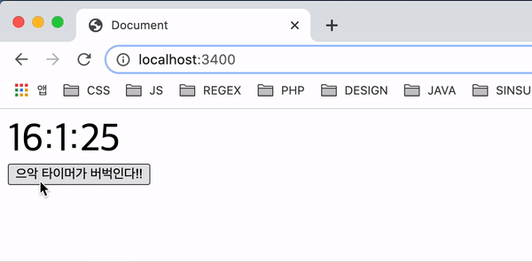

## 웹 워커(Web worker)란?

웹 워커(Web worker)는 스크립트 연산을 웹 어플리케이션의 주 실행 스레드와 분리된 별도의 백그라운드 스레드에서 실행할 수 있는 기술입니다. 웹 워커를 통해 무거운 작업을 분리된 스레드에서 처리하면 주 스레드가 멈추거나 느려지지 않고 동작할 수 있습니다.

## 웹 워커를 사용하는 이유

싱글 스레드 방식으로만 작동 할 수 있다면 연산이 오래걸리는 작업을 진행 할 경우 다른 작업은 진행 할 수가 없습니다. 만약 연산시 5초가 걸리는 작업이 있을 경우 5초동안 다른작업 DOM 업데이트등 을 실행할 수 없어 화면이 멈추게 됩니다. 하지만 Web worker를 사용한다면 연산이 오래걸리는 작업을 맡길 수 있어 주 실행 스레드는 문제없이 DOM 업데이트를 할 수 있습니다.

## 예) 1초마다 갱신되는 시계

```html
<div id="timer"></div>
<button id="button">으악 타이머가 버벅인다!!</button>

<script>
  const timerEl = document.querySelector('#timer')
  const buttonEl = document.querySelector('#button')

  ;(function update() {
    const nowDate = new Date()

    timerTag.innerHTML = `${nowDate.getHours()}:${nowDate.getMinutes()}:${nowDate.getSeconds()}`
    setTimeout(update, 1000)
  })()

  buttonEl.addEventListener('click', function() {
    // 엄청 오래걸리는 작업
    for (let i = 0; i < 50000; i++) {
      console.log(i)
    }
  })
</script>
```



위 코드를 실행하면 문제 없이 1초에 한번씩 컴퓨터 시간을 가져와 보여주게 됩니다. 하지만 버튼을 누르게 된다면 타이머가 버벅이며 2~3초가 한번에 지나가는 것을 볼 수 있습니다. 왜냐하면 setTimeout은 TestQueue에 있다가 callStack이 비는 시점에 넣게 됩니다. 하지만 버튼을 누름으로써 callStack에 5만건의 console.log가 들어가게 되었고 1초가 지났음에도 callStack이 비워지기 전까지 시간 갱신을 못하게 됩니다.

#### callStack 참고

---

[testQueue와 callStack에 관한 설명](https://dawan0111.github.io/javascript/javascript---promise/)

## 해결방법

web worker를 사용하면 됩니다. 일단 worker로 실행시킬 worker.js 파일을 하나 만듭니다.

### worker.js

```javascript
onmessage = function(e) {
  for (let i = 0; i <= e.data; i++) {
    console.log(i)
  }
}
```

## index.html

```html
<div id="timer"></div>
<button id="button">으악 타이머가 버벅인다!!</button>

<script>
  const timerEl = document.querySelector('#timer')
  const buttonEl = document.querySelector('#button')

  const myWorker = new Worker('./worker.js')(function update() {
    const nowDate = new Date()

    timerTag.innerHTML = `${nowDate.getHours()}:${nowDate.getMinutes()}:${nowDate.getSeconds()}`
    setTimeout(update, 1000)
  })()

  buttonEl.addEventListener('click', function() {
    myWorker.postMessage(50000)
  })
</script>
```

이렇게 바꾸게 된다면 엄청 오래 걸리는 작업이 다른 쓰레드에서 처리되어 시계는 문제 없이 1초마다 업데이트 할 수 있게 됩니다.


## 유의할점

web worker는 IE11 버전에는 지원을 하지 않고 사용시 element를 인자로 보낼 수 없다는 특징을 가지고 있습니다.

## 정리

web worker에 대해 알아봤습니다. 만약 IE11 버전을 지원하지 않아도 되고 계산이 많이 필요한 작업이 있을경우 항상 worker를 사용하는 편이 좋다 생각하고 상황에 맞게 사용하면 될 꺼 같습니다. 자세한 내용은 밑 링크 참고하면 됩니다.

[MDN Web workers 내용](https://developer.mozilla.org/ko/docs/Web/API/Web_Workers_API)
